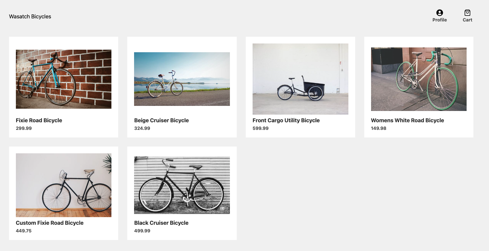

# eCommerce Site | Wasatch Bicycles | Frontend

> Wasatch Bicycles is an eCommerce dummy site built with Next.js, Strapi, Auth0 & Stripe.

#### [View The Site](https://wastach-bicycles.vercel.app/) - This app is live.

<!-- Badge(s) Here -->

---

### Table of Contents

- [Description](#description)
- [Technologies](#technologies)
- [How To Use](#how-to-use)
- [Installation](#installation)
- [References](#references)
- [License](#license)
- [Contributors](#contributors)

---

## Description

The goal of this application was to create a fully functioning eCommerce site. The frontend was built with Next.js and the backend is handled by Strapi. The images are served by Cloudinary.

The user may browse the products, view a product page, add/remove items to the cart, checkout with Stripe and login to view order history.

[Back To The Top](#project-name)

---

#### Technologies

- Next.js
- React.js
- Javascript
- HTML
- Styled Components
- Strapi
- Cloudinary
- Auth0
- Stripe

[Back To The Top](#project-name)

---

## How To Use

View The Live Site - https://wastach-bicycles.vercel.app/

To process a payment use this test credit card information.

- CC#: 4242 4242 4242 4242
- Exp Date: 04/24
- CVC: 424

[Back To The Top](#project-name)

---

#### Installation

Not applicable. Site is live.

[Back To The Top](#project-name)

---

## References

Not applicable

[Back To The Top](#project-name)

---

## License

MIT License

Copyright (c) 2022 Nate Valline

Permission is hereby granted, free of charge, to any person obtaining a copy of this software and associated documentation files (the "Software"), to deal in the Software without restriction, including without limitation the rights to use, copy, modify, merge, publish, distribute, sublicense, and/or sell copies of the Software, and to permit persons to whom the Software is furnished to do so, subject to the following conditions:

The above copyright notice and this permission notice shall be included in all copies or substantial portions of the Software.

THE SOFTWARE IS PROVIDED "AS IS", WITHOUT WARRANTY OF ANY KIND, EXPRESS OR IMPLIED, INCLUDING BUT NOT LIMITED TO THE WARRANTIES OF MERCHANTABILITY, FITNESS FOR A PARTICULAR PURPOSE AND NONINFRINGEMENT. IN NO EVENT SHALL THE AUTHORS OR COPYRIGHT HOLDERS BE LIABLE FOR ANY CLAIM, DAMAGES OR OTHER LIABILITY, WHETHER IN AN ACTION OF CONTRACT, TORT OR OTHERWISE, ARISING FROM, OUT OF OR IN CONNECTION WITH THE SOFTWARE OR THE USE OR OTHER DEALINGS IN THE SOFTWARE.

[Back To The Top](#project-name)

---

## Contributors

- Nate Valline

[Back To The Top](#project-name)

## Tests

Not applicable

[Back To The Top](#project-name)

---

## Questions

Please contact the following for any questions.

 => contact@natevalline.com

[Back To The Top](#project-name)

---
